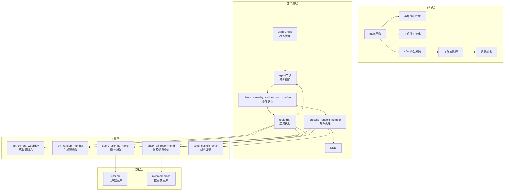
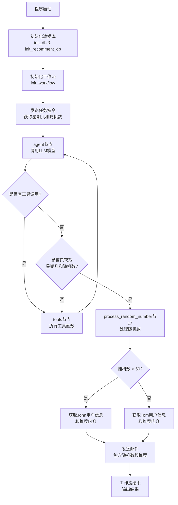

# LLM Agent 邮件工作流系统技术方案

## 1. 项目概述

本项目是一个基于大语言模型(LLM)和LangGraph构建的智能邮件工作流系统，能够根据星期几和随机数条件自动执行邮件发送任务。系统支持动态路由决策、数据库操作和邮件通知等功能，实现了一个完整的自动化工作流程。

### 主要功能

- 自动获取当前星期几和随机数
- 根据随机数大小智能选择邮件接收对象
- 动态组合邮件内容，包含随机数和推荐信息
- 自动发送个性化邮件通知
- 基于LangGraph的状态管理和工作流控制

## 2. 系统架构

系统采用模块化设计，主要分为数据层、工具层、工作流层和执行层四个主要部分。整体架构如下所示：



### 架构说明

1. **数据层**：包含两个SQLite数据库，分别存储用户信息和推荐内容

2. **工具层**：提供各种原子操作工具函数，包括日期时间、随机数生成、数据库查询和邮件发送等功能

3. **工作流层**：基于LangGraph实现的状态管理和流程控制，负责根据条件动态路由和执行任务

4. **执行层**：负责系统初始化、工作流启动和结果输出

## 3. 核心功能模块

### 3.1 数据库管理模块

负责用户数据和推荐数据的存储与管理，包括数据库初始化和查询操作。

**核心函数：**

```python
def init_db():
    """初始化用户数据库信息"""
    if not os.path.exists('user.db'):
        conn = sqlite3.connect('user.db')
        c = conn.cursor()
        c.execute('''create table users
                 (id int primary key not null,
                 name varchar not null,
                 mail varchar not null);''')
        c.execute("insert into users (id, name, mail) " +
                  "values (1, 'John', 'alphachenx@sina.com')")
        c.execute("insert into users (id, name, mail) " +
                  "values (2, 'Tom', 'alphachenx@sina.com')")
        conn.commit()
        conn.close()
        logger.info("数据库初始化完成，创建了测试用户数据")
    else:
        logger.info("数据库已存在，跳过初始化")


def init_recomment_db():
    """初始化推荐数据库信息"""
    # 类似init_db函数，创建推荐数据表并初始化测试数据
```

**数据结构：**
- **users表**：存储用户信息，包含id(主键)、name(用户名)、mail(邮箱地址)
- **recommend表**：存储推荐信息，包含id(主键)、name(推荐标题)、content(推荐内容)

### 3.2 工具函数模块

提供各种原子操作工具函数，集成到LangGraph的工具节点中供Agent调用。

**核心工具函数：**

```python
@tool
def get_current_weekday():
    """获取当前是星期几"""
    weekdays = ["星期一", "星期二", "星期三", "星期四", "星期五", "星期六", "星期日"]
    current_day = datetime.datetime.now().weekday()
    logger.info(f"当前是{weekdays[current_day]}")
    return weekdays[current_day]

@tool
def get_random_number():
    """返回一个随机数，范围是0 到 100 """
    return random.randint(0, 100)

@tool
def query_user_by_name(name: str):
    """查询数据库中指定姓名的用户信息"""
    conn = sqlite3.connect('user.db')
    c = conn.cursor()
    c.execute("SELECT id, name, mail FROM users WHERE name = ?", (name,))
    rows = c.fetchall()
    # 处理查询结果...

@tool
def query_all_recommend():
    """查询数据库中所有的推荐信息"""
    # 实现查询逻辑...
```

### 3.3 邮件发送模块

负责邮件的构建和发送功能，支持自定义邮件内容和主题。

**核心函数：**

```python
def send_custom_email(mail: str, name: str, content: str, subject: str = "自定义邮件"):
    '''发送自定义内容的邮件'''
    # 配置邮件服务器
    smtp_server = "smtp.sina.com"
    smtp_port = 587
    
    # 从环境变量中获取邮件发送者信息
    sender_email = os.getenv("EMAIL_SENDER")
    sender_password = os.getenv("EMAIL_PASSWORD")
    
    # 创建邮件对象
    msg = MIMEMultipart()
    msg['From'] = sender_email
    msg['To'] = mail
    msg['Subject'] = subject
    
    # 添加邮件正文并发送
    # ...详细实现见代码
```

### 3.4 工作流控制模块

基于LangGraph实现的状态管理和流程控制，是整个系统的核心调度中心。

**核心组件：**

1. **状态图构建**

```python
def init_workflow():
    """初始化工作流"""
    # 创建状态图以管理消息状态和流程控制
    workflow = StateGraph(MessagesState)
    
    # 定义节点
    workflow.add_node("agent", call_model)
    workflow.add_node("tools", tool_node)
    workflow.add_node("process_random_number", process_random_number)
    
    # 定义工作流的入口点为agent节点
    workflow.set_entry_point("agent")
    
    # 添加条件边，根据工具调用请求或工具返回结果决定路由
    workflow.add_conditional_edges(
        "agent",
        check_weekday_and_random_number,
    )
    
    # 添加其他边关系
    workflow.add_edge("tools", 'agent')
    workflow.add_edge("process_random_number", END)
    
    # 初始化内存以在状态图运行过程中保持状态
    checkpointer = InMemorySaver()
    
    # 将工作流编译成一个可执行的App
    app = workflow.compile(checkpointer=checkpointer)
    return app
```

2. **条件路由函数**

```python
def check_weekday_and_random_number(state: MessagesState) -> Literal["tools", "process_random_number", END]:
    '''根据工具调用请求或工具返回结果决定路由'''
    messages = state['messages']
    last_message = messages[-1]
    
    # 检查是否有工具调用请求
    if hasattr(last_message, 'tool_calls') and last_message.tool_calls:
        return "tools"
    
    # 检查是否是工具返回的结果
    if hasattr(last_message, 'name'):
        # 检查是否已经获取了星期几和随机数
        weekday_found = False
        random_number_found = False
        for msg in messages:
            if hasattr(msg, 'name'):
                if msg.name == 'get_current_weekday':
                    weekday_found = True
                elif msg.name == 'get_random_number':
                    random_number_found = True
        
        if weekday_found and random_number_found:
            return "process_random_number"
        
        return "tools"
    
    # 其他情况结束对话
    return END
```

3. **随机数处理函数**

```python
def process_random_number(state: MessagesState) -> Dict[str, Any]:
    '''根据随机数处理邮件发送任务'''
    # 从消息中提取星期几和随机数
    weekday = None
    random_number = None
    
    for msg in state['messages']:
        if hasattr(msg, 'name'):
            if msg.name == 'get_current_weekday':
                weekday = msg.content
            elif msg.name == 'get_random_number':
                # 尝试将内容转换为整数
                try:
                    random_number = int(msg.content)
                except ValueError:
                    # 如果转换失败，检查内容中是否包含数字
                    import re
                    numbers = re.findall(r'\d+', msg.content)
                    if numbers:
                        random_number = int(numbers[0])
                    else:
                        random_number = 0
    
    logger.info(f"获取到当前是{weekday}，随机数是{random_number}")
    
    # 根据随机数大小执行不同操作
    if random_number > 50:
        # 随机数大于50，获取John的邮箱并发送邮件
        # ...详细实现见代码
    else:
        # 随机数小于等于50，获取Tom的邮箱并发送邮件
        # ...详细实现见代码
```

## 4. 工作流程详解

系统工作流程主要包括初始化阶段、工具调用阶段、条件判断阶段和任务执行阶段四个部分。下面是详细的工作流程说明：



### 流程说明

1. **初始化阶段**
   - 程序启动后，首先初始化用户数据库和推荐数据库
   - 然后创建基于LangGraph的工作流实例

2. **工具调用阶段**
   - 系统发送任务指令，要求同时获取当前星期几和随机数
   - Agent节点调用LLM模型，生成工具调用请求
   - Tools节点执行相应的工具函数，获取星期几和随机数

3. **条件判断阶段**
   - 系统检查是否已经获取了星期几和随机数
   - 如果已获取，则进入process_random_number节点处理随机数
   - 如果未获取完整，则继续调用工具获取缺失的信息

4. **任务执行阶段**
   - 根据随机数大小决定向John(>50)或Tom(≤50)发送邮件
   - 查询目标用户信息和所有推荐内容
   - 构建包含随机数和推荐信息的邮件内容
   - 发送邮件并输出执行结果

## 5. 核心代码实现

### 5.1 工作流初始化与执行

```python
def init_workflow():
    """初始化工作流"""
    # 创建状态图以管理消息状态和流程控制
    workflow = StateGraph(MessagesState)
    
    # 定义节点
    workflow.add_node("agent", call_model)
    workflow.add_node("tools", tool_node)
    workflow.add_node("process_random_number", process_random_number)
    
    # 设置入口点和边关系
    workflow.set_entry_point("agent")
    workflow.add_conditional_edges("agent", check_weekday_and_random_number)
    workflow.add_edge("tools", 'agent')
    workflow.add_edge("process_random_number", END)
    
    # 编译工作流
    checkpointer = InMemorySaver()
    app = workflow.compile(checkpointer=checkpointer)
    return app

# 主程序执行逻辑
if __name__ == "__main__":
    # 初始化数据库
    init_db()
    init_recomment_db()
    
    # 初始化工作流
    app = init_workflow()
    
    # 定义任务指令：同时获取当前星期几和随机数
    task_instruction = """请同时调用get_current_weekday工具获取当前是星期几，以及调用get_random_number工具获取一个随机数。"""
    
    # 执行工作流
    inputs = {"messages": [HumanMessage(content=task_instruction)]}
    
    # 流式输出结果
    i = 0
    for output in app.stream(
            inputs,
            config={"configurable": {"thread_id": 42}}):
        for key, value in output.items():
            i += 1
            print(f"\n==========={i}、从'{key}'输出:\n{value}")
```

### 5.2 随机数处理与邮件发送

```python
def process_random_number(state: MessagesState) -> Dict[str, Any]:
    # 提取星期几和随机数
    weekday = None
    random_number = None
    for msg in state['messages']:
        if hasattr(msg, 'name'):
            if msg.name == 'get_current_weekday':
                weekday = msg.content
            elif msg.name == 'get_random_number':
                # 处理随机数
                try:
                    random_number = int(msg.content)
                except ValueError:
                    # 提取数字
                    import re
                    numbers = re.findall(r'\d+', msg.content)
                    random_number = int(numbers[0]) if numbers else 0
    
    # 根据随机数大小执行不同操作
    if random_number > 50:
        # 向John发送邮件
        conn = sqlite3.connect('user.db')
        c = conn.cursor()
        c.execute("SELECT id, name, mail FROM users WHERE name = ?", ("John",))
        john_user = c.fetchone()
        conn.close()
        
        if john_user:
            _, name, mail = john_user
            # 获取推荐信息
            recommend_conn = sqlite3.connect('recommend.db')
            recommend_c = recommend_conn.cursor()
            recommend_c.execute("SELECT id, name, content FROM recommend")
            recommend_data = recommend_c.fetchall()
            recommend_conn.close()
            
            # 构建邮件内容
            email_content = f"亲爱的{name}：\n\n您好！这是一封包含随机数和推荐信息的邮件。\n\n随机数：{random_number}\n\n推荐信息：\n"
            for item in recommend_data:
                email_content += f"- {item[1]}: {item[2]}\n"
            email_content += "\n如有任何问题，请随时联系我们。\n\n祝好！\n我们的团队"
            
            # 发送邮件
            result = send_custom_email(mail, name, email_content, "随机数与推荐信息")
            return {"messages": [AIMessage(content=f"任务已完成：随机数{random_number}大于50，已向John发送包含随机数和推荐信息的邮件\n{result}")]}
    else:
        # 向Tom发送邮件，逻辑类似
        # ...详细实现见代码
```

### 5.3 邮件发送核心实现

```python
def send_custom_email(mail: str, name: str, content: str, subject: str = "自定义邮件"):
    # 配置邮件服务器
    smtp_server = "smtp.sina.com"
    smtp_port = 587
    
    # 从环境变量获取发送者信息
    sender_email = os.getenv("EMAIL_SENDER")
    sender_password = os.getenv("EMAIL_PASSWORD")
    
    if not sender_email or not sender_password:
        error_msg = "未配置邮件发送者信息，请检查.env文件"
        logger.error(error_msg)
        return error_msg
    
    # 创建邮件对象
    msg = MIMEMultipart()
    msg['From'] = sender_email
    msg['To'] = mail
    msg['Subject'] = subject
    
    # 添加邮件正文
    msg.attach(MIMEText(content, 'plain'))
    
    try:
        # 连接服务器并发送邮件
        with smtplib.SMTP(smtp_server, smtp_port) as server:
            # server.starttls()  # 如需加密连接可取消注释
            server.login(sender_email, sender_password)
            server.send_message(msg)
            logger.info(f"邮件已发送至 {mail}（{name}），主题：{subject}")
            return f"成功发送邮件至{name}（{mail}）"
    except Exception as e:
        error_msg = f"发送邮件时出错：{str(e)}"
        logger.error(error_msg)
        return error_msg
```

## 6. 环境配置

系统依赖以下环境和配置：

### 6.1 依赖安装

```bash
pip install langchain_core langgraph langchain_ollama python-dotenv
```

### 6.2 环境变量配置

创建.env文件，添加以下配置：

```
EMAIL_SENDER=your_email@sina.com
EMAIL_PASSWORD=your_email_password
```

### 6.3 Ollama配置

系统依赖本地运行的Ollama服务，需要：
1. 安装Ollama并启动服务（默认端口11434）
2. 下载qwen2模型：`ollama pull qwen2:latest`

## 7. 部署与运行

### 7.1 部署步骤
1. 确保已安装所有依赖包
2. 配置.env文件中的邮件发送信息
3. 确保Ollama服务正常运行且已下载qwen2模型
4. 执行主程序

### 7.2 运行命令

```bash
python email_workflow.py
```

## 8. 总结与亮点回顾

本项目成功实现了一个基于LLM和LangGraph的智能邮件工作流系统，具有以下亮点：

1. **模块化设计**：系统采用清晰的模块化架构，各组件职责分明，易于维护和扩展

2. **智能路由**：基于LangGraph实现的条件路由机制，能够根据工具调用结果动态调整工作流路径

3. **自动化任务处理**：系统能够自动获取信息、进行条件判断并执行相应的邮件发送任务

4. **灵活的数据管理**：使用SQLite数据库存储用户和推荐信息，支持动态查询和数据组合

5. **个性化邮件内容**：根据不同条件向不同用户发送包含个性化内容的邮件

通过这种设计，系统实现了从信息获取、条件判断到任务执行的全流程自动化，展示了LLM和工作流技术在自动化办公场景中的强大应用潜力。