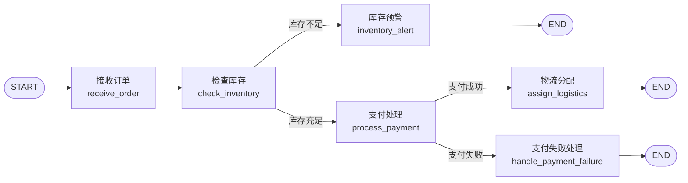

LangGraph 是一个基于图结构的工作流编排工具，用于管理和执行大模型应用中的复杂流程。它将**节点（Node）** 和**边（Edge）** 的思想引入到 Agent 架构中，使得开发者能够清晰定义数据流动、工具调用、模型推理、状态管理过程。

解释 Node 与 Edge 的概念，并通过一个示例说明 `add_node`, `add_edge`, `add_conditional_edges` 等方法的使用。

### 📊 核心概念解析

在 LangGraph 中，工作流被抽象为一张**图（Graph）**，它由**节点（Nodes）**、**边（Edges）** 和**状态（State）** 组成。

| 概念                 | 说明                                                                 | 类比                   |
| :------------------- | :------------------------------------------------------------------- | :--------------------- |
| **节点 (Node)**      | 工作流中的执行单元，是一个 Python 函数，接收状态，处理并返回更新后的状态。 | 工厂的生产线           |
| **边 (Edge)**        | 连接节点，定义节点间的执行顺序和数据流向。                             | 生产线间的传送带       |
| **状态 (State)**     | 一个共享的数据结构（通常是 TypedDict 或 Pydantic Model），在节点间传递信息。 | 在不同生产线间流动的原料和半成品 |
| **条件边 (Conditional Edge)** | 一种特殊的边，根据当前状态的值动态决定下一个要执行的节点。             | 智能分拣机，根据产品属性决定下一站 |

### 🛠️ 关键方法说明

以下是构建图时最常用的几个方法：

1.  **`add_node(node_name, node_function)`**
    用于向图中添加一个节点。
    *   `node_name`: 节点的唯一标识符（字符串）。
    *   `node_function`: 一个 Python 函数，它接收状态（State）作为输入，并返回一个更新后的状态。

2.  **`add_edge(src_node, dst_node)`**
    用于添加一条**普通边**，表示无条件地从源节点 `src_node` 指向目标节点 `dst_node`。

3.  **`add_conditional_edges(src_node, path_func, path_map=None)`**
    用于添加一条**条件边**，根据 `path_func` 的返回值动态决定下一个节点。
    *   `src_node`: 源节点。
    *   `path_func`: 一个函数，接收当前状态，返回一个字符串（或字符串列表），代表下一个节点的名称或一个标识符。
    *   `path_map`: （可选）一个字典，将 `path_func` 返回的标识符映射到实际的节点名称。如果 `path_func` 直接返回节点名，则可省略。

### 📦 示例：订单处理工作流

假设有一个订单处理流程，它包含以下步骤：
1.  **接收订单**（`receive_order`）：验证订单基本信息。
2.  **检查库存**（`check_inventory`）：核查商品库存。
    *   如果库存充足，则进行**支付处理**（`process_payment`）。
    *   如果库存不足，则触发**库存预警**（`inventory_alert`）。
3.  **支付处理**（`process_payment`）：处理订单支付。
    *   如果支付成功，则进行**物流分配**（`assign_logistics`）。
    *   如果支付失败，则触发**支付失败处理**（`handle_payment_failure`）。
4.  **物流分配**（`assign_logistics`）：安排发货。
5.  **结束**（`END`）：流程结束。

库存预警和支付失败处理完成后，流程也结束。

为了更直观地展示这个流程，下图描绘了各个节点和边的走向，特别是条件边带来的分支路径：


下面是使用 LangGraph 实现该工作流的代码：

```python
from typing import TypedDict, Literal
from langgraph.graph import StateGraph, START, END

# 1. 定义状态 State
class OrderState(TypedDict):
    order_id: str
    product_id: str
    quantity: int
    is_valid: bool
    inventory_sufficient: bool
    payment_success: bool
    logistics_assigned: bool
    message: str

# 2. 定义各个节点函数 (Node Functions)
def receive_order(state: OrderState) -> OrderState:
    """节点1: 接收订单"""
    print(f"正在接收订单 {state['order_id']}...")
    # 简单的验证逻辑
    if state['quantity'] > 0:
        state['is_valid'] = True
        state['message'] = f"订单 {state['order_id']} 验证通过。"
    else:
        state['is_valid'] = False
        state['message'] = "订单数量无效。"
    return state

def check_inventory(state: OrderState) -> OrderState:
    """节点2: 检查库存"""
    if state['is_valid']:
        print(f"正在为订单 {state['order_id']} 检查商品 {state['product_id']} 的库存...")
        # 模拟库存检查：假设商品 "item_001" 有 10 个库存
        if state['product_id'] == "item_001" and state['quantity'] <= 10:
            state['inventory_sufficient'] = True
            state['message'] = "库存充足。"
        else:
            state['inventory_sufficient'] = False
            state['message'] = "库存不足。"
    else:
        state['message'] = "订单无效，跳过库存检查。"
        state['inventory_sufficient'] = False
    return state

def process_payment(state: OrderState) -> OrderState:
    """节点3: 处理支付"""
    if state['inventory_sufficient']:
        print(f"正在为订单 {state['order_id']} 处理支付...")
        # 模拟支付处理：假设数量为偶数时支付成功
        if state['quantity'] % 2 == 0:
            state['payment_success'] = True
            state['message'] = "支付成功。"
        else:
            state['payment_success'] = False
            state['message'] = "支付失败。"
    else:
        state['message'] = "库存不足，跳过支付处理。"
    return state

def assign_logistics(state: OrderState) -> OrderState:
    """节点4: 分配物流"""
    if state['payment_success']:
        print(f"正在为订单 {state['order_id']} 分配物流...")
        state['logistics_assigned'] = True
        state['message'] = "已分配物流。"
    else:
        state['message'] = "支付未成功，无法分配物流。"
    return state

def inventory_alert(state: OrderState) -> OrderState:
    """节点5: 库存预警"""
    print(f"警报：订单 {state['order_id']} 所需商品 {state['product_id']} 库存不足！")
    state['message'] = "已触发库存预警。"
    return state

def handle_payment_failure(state: OrderState) -> OrderState:
    """节点6: 处理支付失败"""
    print(f"订单 {state['order_id']} 支付失败，需要人工介入或提醒用户。")
    state['message'] = "支付失败已处理。"
    return state

# 3. 定义条件边所需的路径函数 (Path Functions)
def route_after_inventory_check(state: OrderState) -> Literal["sufficient", "insufficient"]:
    """在检查库存后决定路径"""
    if state['inventory_sufficient']:
        return "sufficient" # 库存充足
    else:
        return "insufficient" # 库存不足

def route_after_payment(state: OrderState) -> Literal["success", "failure"]:
    """在支付处理后决定路径"""
    if state['payment_success']:
        return "success" # 支付成功
    else:
        return "failure" # 支付失败

# 4. 构建图
builder = StateGraph(OrderState) # 创建图构建器，指定状态类型

# 添加节点 (Add Nodes)
builder.add_node("receive_order", receive_order)
builder.add_node("check_inventory", check_inventory)
builder.add_node("process_payment", process_payment)
builder.add_node("assign_logistics", assign_logistics)
builder.add_node("inventory_alert", inventory_alert)
builder.add_node("handle_payment_failure", handle_payment_failure)

# 设置入口节点 (Set Entry Point)
builder.set_entry_point("receive_order")

# 添加边 (Add Edges)
# 从 receive_order 连接到 check_inventory
builder.add_edge("receive_order", "check_inventory")

# 添加条件边：从 check_inventory 根据路由函数分流
builder.add_conditional_edges(
    "check_inventory",
    route_after_inventory_check, # 路径判断函数
    {
        "sufficient": "process_payment", # 库存充足 -> 支付处理
        "insufficient": "inventory_alert" # 库存不足 -> 库存预警
    }
)

# 添加条件边：从 process_payment 根据路由函数分流
builder.add_conditional_edges(
    "process_payment",
    route_after_payment, # 路径判断函数
    {
        "success": "assign_logistics", # 支付成功 -> 分配物流
        "failure": "handle_payment_failure" # 支付失败 -> 支付失败处理
    }
)

# 为“分配物流”、“库存预警”、“支付失败处理”这三个节点添加通向 END 的普通边
builder.add_edge("assign_logistics", END)
builder.add_edge("inventory_alert", END)
builder.add_edge("handle_payment_failure", END)

# 5. 编译图
graph = builder.compile()

# 6. 执行图
# 模拟一个订单
initial_state = {
    "order_id": "order_12345",
    "product_id": "item_001",
    "quantity": 2, # 尝试修改数量为 11（库存不足）或 3（支付失败）来看不同分支效果
    "is_valid": False, # 初始值，会被节点覆盖
    "inventory_sufficient": False,
    "payment_success": False,
    "logistics_assigned": False,
    "message": "",
}
final_state = graph.invoke(initial_state)
print("\n最终状态信息:", final_state['message'])
print("完整最终状态:", final_state)
```

### 💡 总结与建议

LangGraph 通过 **Node**、**Edge** 和 **State** 的概念，让你能清晰地**设计和控制复杂的多步骤工作流**。`add_node`, `add_edge`, `add_conditional_edges` 这些方法是构建这些工作流的基石。

